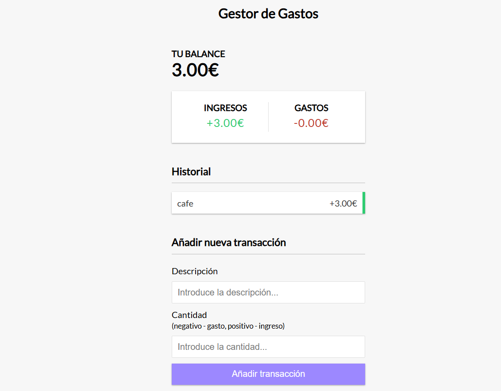

# Gestor de Gastos 💸

### [➡️ Ver Demo en Vivo](https://merimer08.github.io/JS-Gestor-Gastos/) ⬅️

---

## El Proyecto

El objetivo de este proyecto era construir una aplicación interactiva utilizando únicamente **HTML, CSS y JavaScript puro**. La idea era crear una herramienta funcional para llevar un registro de ingresos y gastos, que además persistiera los datos en el navegador para no perder la información entre sesiones.

Este ejercicio demuestra habilidades clave del desarrollo frontend, como la manipulación del DOM, el manejo de eventos y el almacenamiento de datos en el lado del cliente.

---

## Pasos Seguidos para la Creación

El desarrollo se dividió en tres fases principales, abordando primero la estructura, luego el diseño y finalmente la lógica de la aplicación.

### ### 1. Estructura y Maquetación (HTML)

El primer paso fue definir el esqueleto de la aplicación con HTML. El objetivo era crear una estructura semántica y fácil de manipular con JavaScript.

-   **Contenedor Principal:** Se creó un `div.container` para centrar y limitar el ancho de la aplicación.
-   **Visualización de Datos:** Se definieron elementos clave con IDs únicos para mostrar la información:
    -   `#balance`: Para el balance total.
    -   `#money-plus` y `#money-minus`: Para el resumen de ingresos y gastos.
    -   `#list`: Una lista `<ul>` vacía destinada a contener el historial de transacciones.
-   **Entrada de Datos:** Se implementó un formulario `<form>` con dos campos principales: una descripción de tipo `text` y una cantidad de tipo `number`.

### ### 2. Diseño y Estilo (CSS)

Una vez la estructura estuvo lista, el siguiente paso fue darle vida con CSS. La meta era lograr una interfaz limpia, intuitiva y visualmente informativa.

-   **Variables CSS:** Se definieron variables `:root` para los colores principales (verde para ingresos, rojo para gastos), facilitando la consistencia y el mantenimiento del diseño.
-   **Layout con Flexbox:** Se utilizó Flexbox para alinear elementos como el resumen de ingresos y gastos (`.inc-exp-container`).
-   **Feedback Visual:** Se crearon las clases `.plus` y `.minus` que, al ser aplicadas a los elementos de la lista, añaden un borde de color distintivo (verde o rojo) para identificar rápidamente cada tipo de transacción.
-   **Experiencia de Usuario (UX):** Se añadió un pequeño detalle de UX: el botón de eliminar (`.delete-btn`) está oculto por defecto y solo aparece al pasar el ratón sobre una transacción, manteniendo la interfaz limpia.

### ### 3. Lógica de la Aplicación (JavaScript)

Esta fue la fase más compleja, donde se implementó toda la funcionalidad. El código se estructuró en varias funciones para mantenerlo organizado y legible.

-   **A. Conexión con el DOM:** El primer paso fue seleccionar y guardar en constantes todos los elementos HTML con los que se iba a interactuar.

-   **B. Estado y `localStorage`:** Se decidió que la "única fuente de verdad" sería un array de objetos llamado `transactions`. Para lograr la persistencia de datos, este array se sincroniza con el **`localStorage`** del navegador.
    -   Al iniciar, la aplicación intenta cargar las transacciones guardadas con `JSON.parse(localStorage.getItem('transactions'))`.
    -   Cada vez que se añade o elimina una transacción, el array se actualiza en `localStorage` usando `JSON.stringify()`.

-   **C. Renderizado en el DOM:** Se creó la función `addTransactionDOM()` para tomar un objeto de transacción y convertirlo en un elemento `<li>` de HTML, añadiéndolo a la lista en pantalla.

-   **D. Actualización de Cálculos:** La función `updateValues()` es el cerebro de los cálculos. Utiliza los métodos de array **`map`**, **`filter`** y **`reduce`** sobre el array `transactions` para calcular el balance total, los ingresos y los gastos, y luego actualiza el HTML correspondiente.

-   **E. Añadir y Eliminar Transacciones:**
    -   Un `eventListener` en el `submit` del formulario captura los datos, crea un nuevo objeto de transacción y lo añade al array `transactions`.
    -   Para eliminar, se usó delegación de eventos en la lista `<ul>`. Al hacer clic en un botón de eliminar, se obtiene el ID de la transacción y se usa el método **`filter`** para crear un nuevo array sin ese elemento.

-   **F. Inicialización:** La función `init()` se ejecuta al cargar la página. Limpia la lista actual y la repobla con todos los datos de `transactions`, asegurando que la interfaz siempre refleje el estado actual de los datos.

